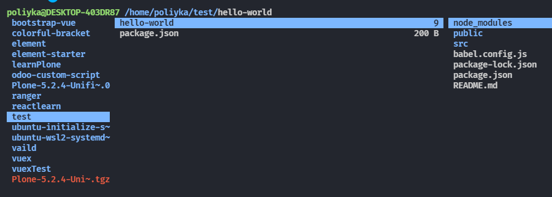
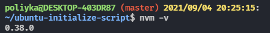
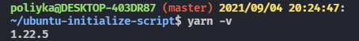
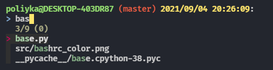
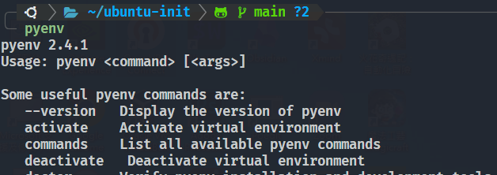
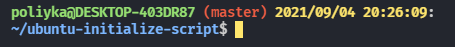
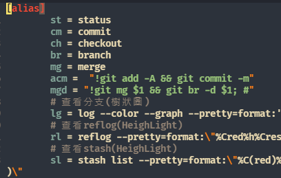

# Ubuntu 20.04 初始化腳本

## Usage

```sh
sudo ./install.sh
```

安裝完成後

```sh
source ~/.bashrc
```

## Introduction

### Ranger

快速瀏覽料夾工具, 啟動方式在 Terminal 中輸入 `ranger`



### Nvm

前端 npm 版本管理工具



### Yarn

前端 yarn package manager



### Fzf

快速查詢檔案功能,快速鍵 `ctrl+t`



### Pyenv

Python 版本管理工具



### BashColor

客製化 `bash` 指令



### GitAlias

客製化 `git` 指令



> ⭐️ **NOTICE**
>
> 1. 不要重複安裝相同的套件，否則會產生 Garbage Code.
> 2. 如有要安裝特定版本請自行修改腳本
